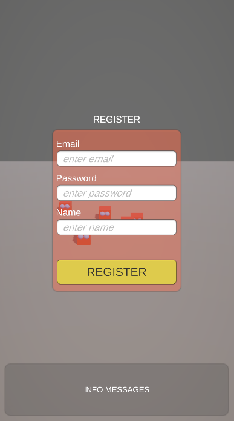
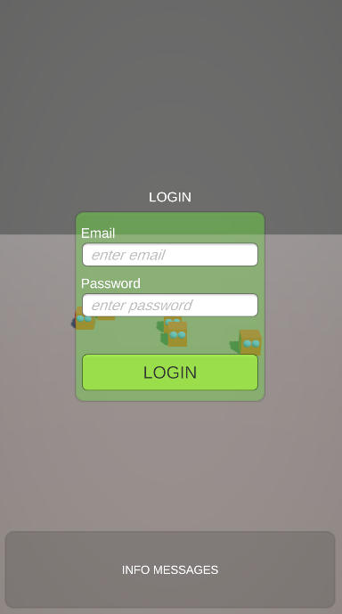

🇹🇷 
# Unity Firebase Örnek Projesi

Bu proje, Unity ile Firebase entegrasyonunun temel kullanımını göstermek amacıyla hazırlanmıştır.
Projede, Firebase Authentication ve Firestore veri tabanı kullanılarak kullanıcı kimlik doğrulama, veri ekleme, veri listeleme ve koleksiyon oluşturma işlemleri örneklenmiştir.

# Özellikler

Firebase Authentication: E-posta ve şifre ile kullanıcı oluşturma ve giriş yapma işlemleri.

Firestore Database:

Koleksiyon ve doküman oluşturma

Veri ekleme

Verileri listeleme

Unity UI Entegrasyonu: Kullanıcı işlemleri için basit arayüz örneği.

# Gereksinimler

Unity 2021 veya üzeri

Firebase Unity SDK [https://firebase.google.com/docs/unity/setup]

GoogleService-Info.plist (iOS) veya google-services.json (Android)

# Kurulum

Bu projeyi klonlayın veya indirin.

Kendi Firebase projenizi oluşturun.

Firebase konfigürasyon dosyasını (google-services.json / GoogleService-Info.plist) Assets/ klasörüne ekleyin.

Projeyi Unity'de açın ve sahneyi çalıştırın.

# Amaç

Bu proje, Firebase ile Unity arasında temel CRUD (Create, Read, Update, Delete) işlemlerinin nasıl yapılacağını öğretmek için hazırlanmış örnek bir uygulamadır.

🇬🇧 
# Unity Firebase Sample Project

This project demonstrates the basic usage of Firebase integration with Unity.
It includes examples for user authentication, creating collections, adding data, and listing data using Firebase Authentication and Firestore Database.

# Features

Firebase Authentication: Create and log in users with email and password.

Firestore Database:

Create collections and documents

Add new data

List existing data

Unity UI Integration: Simple interface for user operations.

# Requirements

Unity 2021 or newer

Firebase Unity SDK [https://firebase.google.com/docs/unity/setup]

GoogleService-Info.plist (iOS) or google-services.json (Android)

# Setup

Clone or download this repository.

Create your own Firebase project.

Add the Firebase configuration file (google-services.json or GoogleService-Info.plist) to the Assets/ folder.

Open the project in Unity and run the scene.

# Purpose

This sample project is designed to teach how to perform basic CRUD operations between Unity and Firebase.
